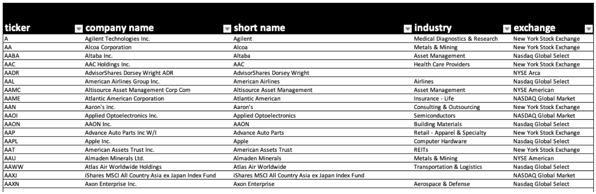
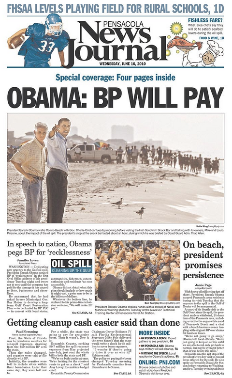
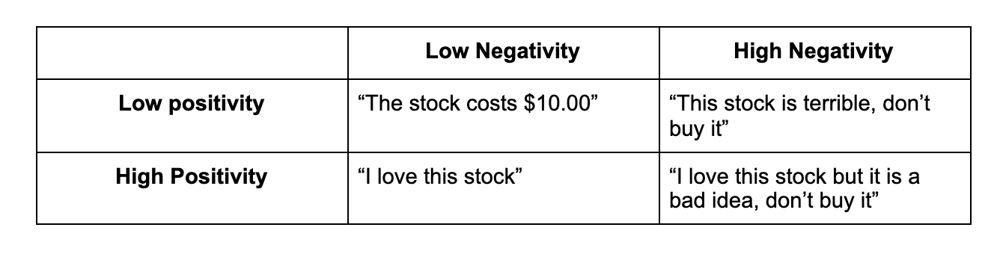

# ReadTheNews
## News Analytics Python Package
*Mykhailo Ivaniuk\
Mateo Osorio\
Veronika Starodubets*

Northwestern University\
March 12, 2021


## Abstract
In this blog post we present ReadTheNews, a package that allows users to automate data collection, processing and feature extraction for use in financial analytics. The package collects text data from reuters.com, and returns all the assets mentioned in the text, along with sentiment analysis for the text. It also collects stock price information for the mentioned assets with a 0,1 and 10 business day windows.

ReadTheNews can be used to experiment with different financial models and used in portfolio optimization algorithms as a novel look into the alternative data portion of financial analytics. 

### What you will learn
Following is a step by step overview of the package, including discussions on how it works, its limitations, and the reasons we organized things the way they are. 
## Outline
- [ReadTheNews](#readthenews)
  - [News Analytics Python Package](#news-analytics-python-package)
  - [Abstract](#abstract)
    - [What you will learn](#what-you-will-learn)
  - [Outline](#outline)
  - [Introduction](#introduction)
    - [What is the goal?](#what-is-the-goal)
    - [Why Reuters?](#why-reuters)
    - [Difficulties & expected challenges](#difficulties--expected-challenges)
    - [Existing Work](#existing-work)
  - [Getting Text Data](#getting-text-data)
    - [What is web scraping and why are we using it?](#what-is-web-scraping-and-why-are-we-using-it)
    - [What tools we're going to use](#what-tools-were-going-to-use)
    - [Code walkthrough](#code-walkthrough)
    - [Data formatting](#data-formatting)
  - [Getting company data](#getting-company-data)
  - [Turning Text into 1s and 0s](#turning-text-into-1s-and-0s)
    - [Computers are bad at reading, but good at math.](#computers-are-bad-at-reading-but-good-at-math)
    - [Brute force approach to asset mentions](#brute-force-approach-to-asset-mentions)
    - [Enter spaCy](#enter-spacy)
    - [What is named entity recognition?](#what-is-named-entity-recognition)
    - [What our output looks like](#what-our-output-looks-like)
    - [What is sentiment analysis?](#what-is-sentiment-analysis)
    - [NLP is not perfect](#nlp-is-not-perfect)
  - [Getting financial data](#getting-financial-data)
    - [Stocks aren't traded every day](#stocks-arent-traded-every-day)
    - [Getting the data we need](#getting-the-data-we-need)
    - [Examining the output](#examining-the-output)
    - [NewsData.csv](#newsdatacsv)
    - [StockData.csv](#stockdatacsv)
  - [Using the package](#using-the-package)
## Introduction
### What is the goal?
The goal of [name] is to allow people to begin implementing alternative data into their financial analytics. [name] does all the most annoying parts, such as web scraping, data management and asset counting, and provides a processed final product that can easily be later used. 
### Why Reuters?
Reuters is globally recognized for being a thorough, well rounded and respected news source, especially when it comes to financial news. They have a global team of world-class journalists, and go far to make their work impartial and unbiased. We decided to use them for the quality of reporting, and because they cover only the most relevant information, and avoid flashy headlines just to get clicks. 
  


### Difficulties & expected challenges
*Time:* always when starting projects like these, it’s important to keep time in mind. If the code we write has to read, copy, analyze and interpret thousands and thousands of long articles, we can expect it to take a while. As we began our work, we kept this in mind to write fast, efficient code, as well as avoid repeating tasks multiple times.

*Data management:* We will be working with tens of thousands of data points (maybe more), so it will be crucial to be organized and space efficient. Again, try not to do the same things lots of times.

*Language is hard:* As we will explore later on, language is hard for computers to understand well, so we can expect to run into issues as we handle Reuters text. 
### Existing Work
We are far from being the first to attempt this. This has been done successfully in Academia, Industry, and there was even a popular Kaggle Competition tackling this same problem. All of the linked sources helped us tremendously, and we would like to thank these (and more, listed at the end of the article) for their contribution and open-source work. ([Columbia](https://www.scitepress.org/papers/2014/51744/51744.pdf), [Kaggle Two Sigma](https://www.kaggle.com/c/two-sigma-financial-news/overview), [JP Morgan](https://www.academia.edu/42040250/Big_Data_and_AI_Strategies_Machine_Learning_and_Alternative_Data_Approach_to_Investing_Quantitative_and_Derivatives_Strategy))

## Getting Text Data
### What is web scraping and why are we using it?
“Hours of work can save you minutes of planning”. One of my old professors loved saying that about programming, and he was 100% right. The first step on our list is to somehow download all the Reuters articles from the past year, and store them in a way that makes them easy to access. Additionally, we’d also like this to not take forever and to not take up too much space or break anything. 

What we need is to visit all the article pages from the website, copy the relevant data (the headline, the date, the article text itself) and put it in a .csv file. We could do this manually, of course, but computer scientists are lazy, so let’s think about how we could automate this. 
Almost all websites are written in what’s called HTML, which is standard across the industry. The HTML file is just a file of text, which your browser interprets and displays it so it looks nice on your screen. Everything that’s on a website (especially one as simple as Reuters) is in that HTML file, making it easy for a computer to look at the HTML contents of a website we point to, and fetch the relevant fields. 

This is called web scraping. Computers go online and navigate the web (just like you or I would), all while performing certain tasks. Let’s look at exactly how we implement this. 

### What tools we're going to use
[Talk about Selenium and Beautifulsoup]

### Data formatting
From each article, we want to extract the information that will be most useful for us. Here, we want the title, the date, and the text. Notice this is pretty much exactly the same information we (humans) get when we are reading an article.

## Getting company data
Luckily, there are armies of people online who do this stuff all day, so we can use resources that already exist to make our lives easier. One piece of data we absolutely need is Company data, where we have the name and ticker price of the companies we care about. Thanks to [SOURCE], we found this very convenient .csv file with the full name, short name, and ticker of the companies we’re working with. 

  

## Turning Text into 1s and 0s 
### Computers are bad at reading, but good at math. 
The English we read and write is very far removed from the language in which computers operate. We use irony, sarcasm, double-meaning words and we even make up words spontaneously. All of these things are a recipe for disaster when trying to translate that into something computers can work with. Remember, computers can only do one thing: math. So the start of the problem is turning this language problem into a math problem. 

> - *Silver is really going up in price*
>
> - *The silver lining is that everything is OK*
>  
> - *He bought a brand new Mercedes, it’s silver**

*Words can have LOTS of different meanings.*

> - *I want to buy a silver spoon*
>
> - *She was born with a silver spoon in her mouth*

*Humans love expressions and idioms.*

> - *This soup is really bad.*
>
> - *This soup isn’t bad, really*

*Very small changes in wording can change the meaning drastically.*

> - *He went on a walk and started shooting*

*Very different if we’re talking about a criminal or a photographer! Context is key with language.* 

> - *The dog has a toy. It’s brown*

*Is the dog brown? Or the toy? If it’s hard for us, imagine a computer trying to make sense.*


So how do we turn a Reuters article from a long, ambiguous piece of human text into numbers we can use to do math with?

Firstly, we have to establish what numbers we want, and what numbers are relevant to our problem. Let’s think about how a human would go about making an investment portfolio, if all they could use was the news. There’s two things that come to mind that our hypothetical investor would look at:
1. *Asset mentions*: How many times is a company mentioned in the news? If it’s mentioned multiple times a day for a long span of time, it’s probably safe to assume that something is happening with the price of that company’s stock. Inversely, if we never read about it in the news, we can’t really tell whether or not it’s a good investment. 
2. *Sentiment*: If a company is getting quite a lot of press attention, it’s hard to tell whether or not that’s good or bad if we only know how many times a company is mentioned. A company can get lots of press if it’s thriving (a successful IPO, a big merger or acquisition), or if it’s struggling (declaring bankruptcy, massive industrial accident). Context is important!

We need to turn our Reuters articles into numbers that represent those two things. Let’s explore the first task, which is having the computer keep track of which companies are being mentioned. 

### Brute force approach to asset mentions
Often in this field of study, the simplest approaches work best, so we begin with the most obvious solution to finding asset mentions. For every word in every article, let’s scan our companies.csv file and look for matches. 
It doesn’t take long for our computer to catch fire, our hair to fall out and our task to fail spectacularly. Comparing every word to every company takes a LONG time when you have a year’s worth of articles. And additionally, word-by-word analysis just doesn’t work for our application. There are dozens of companies whose names have two or more words, and this approach will not catch them. 

> *American Airlines* is a publicly listed company, but as we loop through every word in the article, we'll run into issues. *American* is part of many other stock names, and there are quite a few stocks with *Airlines* in the name. 

We can try to do this in groups of two or three words, but our already unbearably slow programming would get orders of magnitude slower as you add more and more options to check. So how do we figure out what companies are mentioned in each article without avoidable grey hairs?

### Enter spaCy
If the simplest solution doesn’t work, usually the second form of action is a good old fashioned Google search. [SpaCy](https://spacy.io/) is an industry-standard NLP (Natural Language Processing) engine, which means that they do all the complicated stuff for us. It works by using pretty complex neural networks which have been trained with terabytes of data before they find themselves in your computer, ready to use. It doesn’t just look at the text, word by word, but rather as different sequences of different lengths. The technical part of how it works is complicated, and I suggest going to their website and reading more if you’re interested. All we need to know for this application is that it’s one of our best ways of actually interpreting text automatically, and understanding context, allowing us to do something like this. 

### What is named entity recognition?

One of the magical things that SpaCy does is called Named Entity Recognition. The clever algorithm reads the text and identifies all the words or word sequences which correspond to different entities, like people, places, products, or (drumroll please) companies. 

  

SpaCy conveniently saves all of these entities and assigned categories to them based on what they are. ORG, GPE, and MONEY are all categories in the above example. 
ORGs are organizations, and this is where companies fall into. So if we pass the text data from the article into SpaCy, and then make a list of all the ORGs, we’re left with a list of strings from the text that we know are organizations, and some of those are the companies that we care about. 

For each article, we now have a list of pretty abstract strings. Closer to our end goal, but not quite there yet. We still need to do more work. 

A lot of these “organizations” we don’t really care about. Since we’re looking at stock prices, we only care about publicly listed companies, the ones listed in the companies.csv file we talked about a couple of sections above. 
To “link” the relevant companies to their corresponding company, we can use the text from the articles and see if that name is in the list of companies. If it is, we can add that company to a dictionary to keep track of which companies were mentioned, and how many times they were mentioned. 

### What our output looks like

We are left with a nifty function that takes in a piece of text, and outputs a dictionary with the mentioned tickers and a summary of what we found. Best part is, it’s super quick, since we’re being pretty efficient (and the people who wrote SpaCy are quite smart, thankfully). 

### What is sentiment analysis?
We now have a way of measuring how much a certain company is mentioned in the news across time, but while some people in the ad business maintain that “all publicity is good publicity”, that is definitely not the case in the stock market casino. Companies can do something really bad, get caught with their hands dirty, or just have bad luck, all while newspapers and journalists have a field day reporting their demise. In general, this is not great news for investors of said companies, so it would be very helpful for our program to have an idea of what is being said about the mentioned companies.

  

Luckily, just like SpaCy helped us with Entity recognition, there are other plug-and-play libraries that tell us the general mood of a piece of text. In NLP terms, this is called the sentiment of the text. There are many metrics which we can use to try to figure out the sentiment of text, but we’re going to stick to basic ones here. 

- Positivity: how positive the text is (shocker)
- Negativity: how negative it is (who would’ve thought)

Both of these range from 0 to 1.



### NLP is not perfect
Every time computers have to interpret natural language, they will enevitably get something wrong. A 10 second conversation with Siri, who has arguably one of the most advanced NLP systems out there, will prove just how long of a way we still have to go until these machines actually understand what we’re saying. 


In our implementation, we are relying on a couple of systems which are bound to have errors. It is very likely, for example, that SpaCy will miscategorize item sequences as ORGs when they aren’t, or miss a few. This is both inevitable, and very hard to correct, so we will take what we can get with our few lines of code, and cross our fingers that smart researchers will keep improving the algorithms that make all of this possible. 

Additionally, each NLP problem or use case has its own unique set of quirks. For us, since, we’re dealing with company names, there’s a couple to keep in mind. For example, Intel is a company, but it’s also part of the name of a bunch of other companies, like “Gol Linhas Aereas Inteligentes”, “Intelsat” or “Intellicheck”. Another case is Blackrock. There are about 30 assets in the NYSE that contain the string “BlackRock”, and our program will return all 30 of these every time the string is mentioned in an article. 
These edge cases have to be handled by hand, which is the worst nightmare of a data scientist but a necessary evil at certain points. 

## Getting financial data
The next step is actually getting the financial data we care about. There is a LOT of information about stocks out there, making it important to establish what data we actually care about. 
The obvious starting point is to fetch the price of the asset mentioned that day. Since we also want to find out the effect of the news piece on the price, it’s probably a good idea to fetch the price a few days after the piece came out. Here, we choose a 10 business day window and a 1 business day window. 
For every asset mention, our goal is therefore to fetch 3 bits of financial data: the price of the stock the day the article was published, the price the day after, and the price 10 days after. But here we have an interesting problem:

### Stocks aren't traded every day
Stocks trading happens at very precise times: business days during business hours. Reuters journalists, much to their distaste, aren’t quite so lucky with their schedules. News articles are published ‘round the clock, including weekends and even holidays. This creates a bit of a problem, because we have to choose what to do with those 0, 1, and 10 day windows and how they interact with non-trading days. 

We use the IEX trading API to generate a list of dates for each asset mention. With some clever code and the help of the API (which automatically helps us determine trading days from non-trading days), we populate the list with three dates. If our article was published on a non-trading day, we skip to the next available trading day, and do the same for the other two windows. 

### Getting the data we need
We are now left with a ticker and three dates. We now need a couple of standard data points (closing price, opening price, etc) for that company on that day. In comes Polygon API, which allows us to do exactly that. We configure it so it returns the stock price info for the company with the ticker we want on the days that we want. Lovely!
### Examining the output
When all is finished running, there are two outputs. Let’s look at what each row of these two files means. 
### NewsData.csv
```
[text]: The full text from the article
[title]: The title of the article
[AssetMentions]: a list of assets that were mentioned, in format [‘TCKR1’, ‘TCKR2’, ...] where each value is the ticker that’s found. 
[TotalMentions]: Total number of asset mentions.
[day0]: First trading day after article was published. 
[sentence_count]: how many sentences in the article
[word_count]: how many words are in the article
[lemmatized: text after processing
[score]: Overall sentiment score (-1 to 1)
[v_scores]: result from sentiment analysis. Gives values for
Neg: negativity (0-1)
Neu: neutrality (0-1)
Pos: positivity (0-1)
Compound: compound (-1 to 1). Same as [score]
```
### StockData.csv
```
[ticker]: ticker of the asset
[day0]: mm/dd/yy of day 0
[data0]: data from day 0. If using Polygon, fields are [‘open’, ‘close’, ‘after hours’, ‘pre-market’]. If using IEX, fields are [‘open’, ‘close’, ‘low’, high’]
[day1]: mm/dd/yy of day 1
[data1]: : data from day 1. Same fields as [data0]
[day10]: mm/dd/yy of day 10
[data10]: : data from day 10. Same fields as [data0]

```
## Using the package
To install, use the following commands in a conda environment. Make sure pip is at least version 21. 
```
pip install reutersana7yzer
python -m spacy download en_core_web_sm
```
After you installed required dependencies, **Download trading_days.csv, companies.csv and 1700pages.csv** from this this repo and put them in the same directory as your python file where you are going to call NewsAnalyzer.
To test if everything is correctly installed, run the following in python
```
from newsanalyzer import NewsAnalyzer
```
The main function is as follows
```
NewsAnalyzer(workType,api,token,name,path,count)
```
If you want to see how the overall process looks like run the NewsAnalyzer with workType 'demo'.
Where the function arguments are as follows
```
workType - ['sample', 'full','demo','scrape','analyze','custom'] string that specifies mode.
api - ['iex','poly'] API that we'll be using to fetch financial data. Right now we support IEX Trading and Polygon APIs.
token - Your token for specified API
name - string. Name of the file that you want to analyze or where you want to load your scraped data
path - Redundant component, but it was in the earlier versions of the package
count - int. Number of articles you want to scrape. One month contains around 350 articles

```
When the function returns it's going to create NewsData.csv and StockData.csv in the same folder as your program is. However, because of conversion some formats are lost when saving/reading a csv. This mainly affects our StockData.csv as lists in columns **data0**,**data1**,**data10** get converted to strings when loading this csv using pandas. To fix this, load the StockData.csv as follows:
```
import pandas as pd

df = pd.read_csv('StockData.csv', converters={'data0': eval,'data1': eval,'data10': eval})
```
This will convert **data0**,**data1**,**data10** back to the list of floats.
